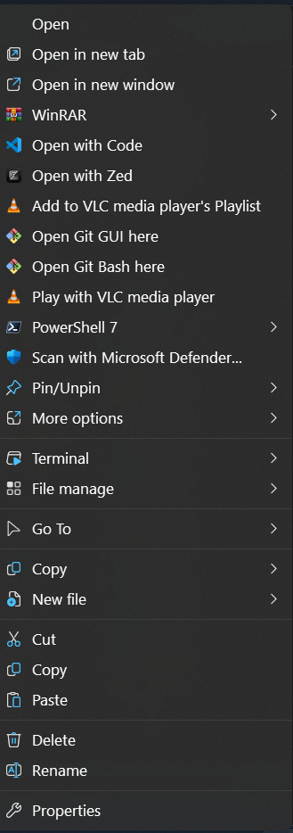

<div align="center">


# Nilesoft Shell Config

A clean, modern **Windows 11 right‑click menu** powered by [Nilesoft Shell](https://nilesoft.org) —
with custom **Copy**, **New file**, and **System** menus on top of a tidy base configuration.

[](https://nilesoft.org)
[](https://github.com/moudey/Shell)
[](LICENSE)
[](https://github.com/Abdullah-Masood-05/nilesoft-shell-config/releases/latest)
[](https://github.com/Abdullah-Masood-05/nilesoft-shell-config/releases)
[](https://github.com/Abdullah-Masood-05/nilesoft-shell-config/stargazers)

</div>

---

## ✨ What you get

On top of Nilesoft Shell's themed base menu (Terminal, File manage, Go To, Develop, Pin/Unpin…),
this config adds three polished submenus, all using crisp built‑in vector icons:

| Menu | What it does |
| --- | --- |
| **Copy** | Copy the full path, quoted path, name, name‑without‑extension, extension, or parent folder of the selected item(s) to the clipboard. |
| **New file** | Instantly create a new `.txt`, `.md`, or `.py` file in the current folder. |
| **System** | Desktop / folder‑background tools: Restart Explorer, Empty Recycle Bin, Flush DNS, God Mode, Lock, Sleep, Sign out, Restart, Shut down. |

> The menu is themed with the **modern** dark theme, tip popups, and subtle show‑delay for a native Windows 11 feel.

## 📸 Screenshot

<div align="center">
  
</div>

## ✅ Requirements

- Windows 10 or 11
- [Nilesoft Shell](https://nilesoft.org) installed
  (`winget install --id Nilesoft.Shell -e`)

## 🚀 Install

### Option A — Installer (recommended)

1. Download **`nilesoft-shell-config-setup.exe`** from the
   [latest release](https://github.com/Abdullah-Masood-05/nilesoft-shell-config/releases/latest).
2. Run it (it backs up your current config, copies the new one in, and reloads the menu).

### Option B — Script

```powershell
git clone https://github.com/Abdullah-Masood-05/nilesoft-shell-config.git
cd nilesoft-shell-config
powershell -ExecutionPolicy Bypass -File .\install.ps1
```

`install.ps1` self‑elevates (UAC), backs up your existing `shell.nss` + `imports\` to a
timestamped `config-backup-…` folder, copies this config into your Nilesoft Shell folder,
then runs `shell.exe -register` and `-restart`.

### Option C — Manual

Copy `shell.nss` and `imports\*.nss` into your Nilesoft Shell folder
(usually `C:\Program Files\Nilesoft Shell`), then hold **Ctrl + right‑click** to reload.

## 🔄 Reloading after edits

Any time you change a `.nss` file, hold **Ctrl** and **right‑click** anywhere to reload —
no reboot. Errors (if any) are written to `shell.log` in the Nilesoft Shell folder.

## ↩️ Revert

Run `uninstall.ps1` to restore the most recent `config-backup-…` that `install.ps1` created.

## 🗂️ Repo structure

```
nilesoft-shell-config/
├── shell.nss              # entry point: settings, theme, import list
├── imports/
│   ├── theme.nss          # colors, fonts, effects
│   ├── images.nss         # icon vocabulary (SVG @id definitions)
│   ├── modify.nss         # tweaks/removals of system menu items
│   ├── terminal.nss       # Terminal menu
│   ├── file-manage.nss    # File manage menu
│   ├── develop.nss        # Develop menu (editors, dotnet…)
│   ├── goto.nss           # Go To menu
│   ├── taskbar.nss        # taskbar items
│   └── my-tools.nss       # Copy / New file / System (custom)
├── install.ps1            # self-elevating installer
├── uninstall.ps1          # restore last backup
├── installer/
│   └── nilesoft-shell-config.iss   # Inno Setup project (builds the .exe)
└── assets/
    ├── icon.svg
    └── icon-256.png
```

## 🎨 Customizing

Icons come from `imports/images.nss`. Reference them as **`icon.<name>`** (e.g. `icon.copy`,
`icon.new_file`, `icon.settings`) — not `@<name>` — so the icon system sizes them correctly.
See the [Nilesoft Shell docs](https://nilesoft.org/docs) for the full DSL.

## 🙏 Credits

- Built on **[Nilesoft Shell](https://github.com/moudey/Shell)** by Moudey (MIT) — the engine that
  makes all of this possible. The base import files are adapted from its default configuration.
- Customizations, the **my-tools** menu, installer, and icon by
  [@Abdullah-Masood-05](https://github.com/Abdullah-Masood-05).

## 📄 License

[MIT](LICENSE)
